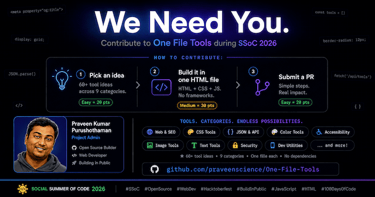

# One File Tools

A growing collection of useful developer tools, each built as a **single, self-contained HTML file**.

No build step. No frameworks. No npm. Just open the file in your browser and it works.



## Why?

Most developer tools today come with baggage:

- `npm install` with 200+ packages.
- Framework lock-in.
- Complex build pipelines.
- Servers, databases, deployment configs.

**This repo takes the opposite approach.**

> One tool. One file. Open and use.

Every tool in this collection is a standalone `.html` file containing all the HTML, CSS, and JavaScript it needs. You can download a single file, open it in any browser, and start using it immediately. CDN links are used for lightweight libraries and fonts to keep files slim.

## Available Tools

<!-- Auto-generated by: node scripts/sync-readme.js — do not edit manually -->

| # | Tool | Category | Description | Live |
|---|------|----------|-------------|------|
| 1 | [.env Parser & Validator](tools/env-parser-validator.html) | Developer Utilities | Parse, validate, mask, search, and export .env files entirely in the browser. | [Try it](https://one-file-tools.pages.dev/tools/env-parser-validator) |
| 2 | [.env Parser & Validator (Strict Mode)](tools/env-strict-parser-validator.html) | Developer Utilities | Parse .env files under strict rules, with detailed line-by-line validation, quick-fix suggestions, and metrics. | [Try it](https://one-file-tools.pages.dev/tools/env-strict-parser-validator) |
| 3 | [A11y Contrast Grid Generator](tools/a11y-contrast-grid.html) | Accessibility | Generate a comprehensive accessibility matrix comparing all background and foreground color combinations against WCAG 2.1 contrast guidelines. | [Try it](https://one-file-tools.pages.dev/tools/a11y-contrast-grid) |
| 4 | [Advanced Robots.txt Generator](tools/advanced-robots-txt-generator.html) | Web & SEO | Visually create and customize robots.txt files with support for multiple user-agents, crawl rules, sitemaps, and instant code generation. | [Try it](https://one-file-tools.pages.dev/tools/advanced-robots-txt-generator) |
| 5 | [Alt Text Helper](tools/alt-text-helper.html) | Accessibility | Draft image alt text and get instant feedback on whether it's clear, concise, and accessible. | [Try it](https://one-file-tools.pages.dev/tools/alt-text-helper) |
| 6 | [Animation Cubic-Bezier Editor](tools/animation-cubic-bezier-editor.html) | CSS Tools | Visually create and customize CSS cubic-bezier() easing functions with a live animation preview. | [Try it](https://one-file-tools.pages.dev/tools/animation-cubic-bezier-editor) |
| 7 | [API Response Mocker](tools/api-response-mocker.html) | JSON & API | Define custom JSON responses and simulate API endpoints directly in the browser. | [Try it](https://one-file-tools.pages.dev/tools/api-response-mocker) |
| 8 | [ARIA Role Reference](tools/aria-role-reference.html) | Accessibility | A fast, offline reference for common WAI-ARIA roles with attributes, semantic alternatives, and examples. | [Try it](https://one-file-tools.pages.dev/tools/aria-role-reference) |
| 9 | [ASCII / UTF-8 Text to Binary Converter](tools/text-binary-converter.html) | Text & Content | Encode plain text characters into binary byte structures, or translate stream bits back into readable text. | [Try it](https://one-file-tools.pages.dev/tools/text-binary-converter) |
| 10 | [Aspect Ratio Calculator](tools/aspect-ratio-calculator.html) | Image Tools | Calculate and simplify aspect ratios instantly. Supports common presets and outputs decimal ratio and CSS padding-bottom values. | [Try it](https://one-file-tools.pages.dev/tools/aspect-ratio-calculator) |
| 11 | [Base64 Encoder / Decoder](tools/base64-encoder-decoder.html) | Developer Utilities | A simple, offline utility to encode raw text into Base64 format and decode Base64 strings back to text. | [Try it](https://one-file-tools.pages.dev/tools/base64-encoder-decoder) |
| 12 | [Base64 Image Converter](tools/base64-image-converter.html) | Image Tools | Convert images to Base64 data URIs, or decode Base64 strings back into viewable images. | [Try it](https://one-file-tools.pages.dev/tools/base64-image-converter) |
| 13 | [Bash Sandbox](tools/bash-commands-sandbox.html) | Developer Utilities | A simulated bash terminal to play with and learn common commands, entirely in your browser. | [Try it](https://one-file-tools.pages.dev/tools/bash-commands-sandbox) |
| 14 | [Binary Decimal Converter](tools/binary-decimal-converter.html) | Developer Utilities | Convert between binary, decimal, hexadecimal, and octal. | [Try it](https://one-file-tools.pages.dev/tools/binary-decimal-converter) |
| 15 | [Box Shadow Generator](tools/box-shadow-generator.html) | CSS Tools | Design CSS box shadows visually with live preview, presets, and copy-ready output. | [Try it](https://one-file-tools.pages.dev/tools/box-shadow-generator) |
| 16 | [Canonical URL Checker](tools/canonical-url-checker.html) | Web & SEO | Analyze HTML to verify canonical URL implementation and identify common SEO issues. | [Try it](https://one-file-tools.pages.dev/tools/canonical-url-checker) |
| 17 | [Canonical URL Checker](tools/canonical-url-checker-new.html) | Web & SEO | Analyze HTML to verify canonical URL implementation and identify common SEO issues. | [Try it](https://one-file-tools.pages.dev/tools/canonical-url-checker-new) |
| 18 | [Case Converter](tools/case-converter.html) | Text & Content | Transform text between UPPERCASE, lowercase, camelCase, snake_case, and more. | [Try it](https://one-file-tools.pages.dev/tools/case-converter) |
| 19 | [Chmod Calculator](tools/chmod-calculator.html) | Developer Utilities | Interactively build Unix file permissions and get the numeric and symbolic chmod values. | [Try it](https://one-file-tools.pages.dev/tools/chmod-calculator) |
| 20 | [Chrono / Timezone Converter](tools/timezone-converter.html) | Developer Utilities | Visually synchronize and convert time across multiple global timezones. | [Try it](https://one-file-tools.pages.dev/tools/timezone-converter) |
| 21 | [CIE Chromaticity Gamut Visualizer](tools/cie-chromaticity-gamut-visualizer.html) | Color Tools | A color space analysis canvas that plots custom colors onto a CIE 1931 chromaticity diagram against sRGB, Display P3, and Rec.2020 gamut boundaries. | [Try it](https://one-file-tools.pages.dev/tools/cie-chromaticity-gamut-visualizer) |
| 22 | [Clip Path Generator](tools/clip-path-generator.html) | CSS Tools | Visually create complex CSS clip-path shapes and instantly copy the generated code. | [Try it](https://one-file-tools.pages.dev/tools/clip-path-generator) |
| 23 | [Code Snippet Manager](tools/code-snippet-manager.html) | Developer Utilities | Store, categorize, and retrieve code snippets with syntax highlighting, entirely offline. | [Try it](https://one-file-tools.pages.dev/tools/code-snippet-manager) |
| 24 | [Color Blindness Simulator](tools/color-blindness-simulator.html) | Color Tools | Simulate how colors and images appear with Protanopia, Deuteranopia, Tritanopia, and Achromatopsia to design more accessible interfaces. | [Try it](https://one-file-tools.pages.dev/tools/color-blindness-simulator) |
| 25 | [Color Blindness Simulator](tools/color-blindness-simulator-v2.html) | Color Tools | Preview how colors and images appear under different types of color vision deficiency. | [Try it](https://one-file-tools.pages.dev/tools/color-blindness-simulator-v2) |
| 26 | [Color Mixer Tool](tools/color-mixer-tool.html) | Color Tools | Mix colors and generate harmonious color palettes. | [Try it](https://one-file-tools.pages.dev/tools/color-mixer-tool) |
| 27 | [Color Palette Extractor](tools/color-palette-extractor.html) | Image Tools | Extract dominant colors and generate beautiful palettes directly from images in your browser. | [Try it](https://one-file-tools.pages.dev/tools/color-palette-extractor) |
| 28 | [Color Palette Generator](tools/color-palette-generator.html) | Color Tools | Generate beautiful random color combinations for designers and frontend developers. | [Try it](https://one-file-tools.pages.dev/tools/color-palette-generator) |
| 29 | [Color Picker](tools/color-picker.html) | Color Tools | Pick a color and view it in HEX, RGB, HSL, and HSV, with generated shades and recent colors. | [Try it](https://one-file-tools.pages.dev/tools/color-picker) |
| 30 | [Command Step Loader](tools/command-step-loader.html) | Developer Utilities | Load multiple commands and copy them one at a time with a terminal-style interface. | [Try it](https://one-file-tools.pages.dev/tools/command-step-loader) |
| 31 | [Commit Message & Range Cleaner](tools/git-commit-range-cleaner.html) | Developer Utilities | Paste a git log excerpt and generate interactive-rebase plans + normalized Conventional Commits suggestions. | [Try it](https://one-file-tools.pages.dev/tools/git-commit-range-cleaner) |
| 32 | [Commit Message Generator](tools/commit-message-generator.html) | Developer Utilities | Build Conventional Commits-formatted commit messages with live preview and validation. | [Try it](https://one-file-tools.pages.dev/tools/commit-message-generator) |
| 33 | [Container Query Sandbox](tools/container-query-sandbox.html) | CSS Tools | A visual builder and live tester for CSS Container Queries (@container) that react to parent dimensions rather than the viewport. | [Try it](https://one-file-tools.pages.dev/tools/container-query-sandbox) |
| 34 | [Content-Visibility & Intersection Debugger](tools/content-visibility-debugger.html) | Developer Utilities | A performance debugging tool that visualizes content-visibility: auto states to help developers track layout and paint skipping. | [Try it](https://one-file-tools.pages.dev/tools/content-visibility-debugger) |
| 35 | [Contrast Checker](tools/contrast-checker.html) | Color Tools | Check the WCAG 2.1 contrast ratio between two colors with AA/AAA compliance and a live text preview. | [Try it](https://one-file-tools.pages.dev/tools/contrast-checker) |
| 36 | [Contrast Checker (A11y)](tools/contrast-checker-a11y.html) | Accessibility | WCAG 2.1 AA/AAA contrast checker with live UI previews and an automatic fix suggestion. | [Try it](https://one-file-tools.pages.dev/tools/contrast-checker-a11y) |
| 37 | [Cookie Viewer](tools/cookie-viewer.html) | Browser & Network | Inspect, create, edit, delete, and search cookies for the current site — no dev tools required. | [Try it](https://one-file-tools.pages.dev/tools/cookie-viewer) |
| 38 | [Cron Expression Builder](tools/cron-expression-builder.html) | Developer Utilities | Build and customize cron schedules with presets, instant validation, explanations, and upcoming run previews. | [Try it](https://one-file-tools.pages.dev/tools/cron-expression-builder) |
| 39 | [Cron Run Planner](tools/cron-run-planner.html) | Developer Utilities | Visualize upcoming cron run times across multiple timezones with a timeline and export. | [Try it](https://one-file-tools.pages.dev/tools/cron-run-planner) |
| 40 | [CSS Animation Builder](tools/css-animation-builder.html) | CSS Tools | Visually create CSS animations and export keyframes without manually writing CSS. | [Try it](https://one-file-tools.pages.dev/tools/css-animation-builder) |
| 41 | [CSS Color Converter](tools/css-color-converter.html) | Color Tools | Convert between Hex, RGB, HSL, HSLA, and OKLCH color formats instantly with a visual picker. | [Try it](https://one-file-tools.pages.dev/tools/css-color-converter) |
| 42 | [CSS Custom Property Fallback Chain Debugger](tools/css-fallback-debugger.html) | CSS Tools | A visual analyzer for deeply nested CSS var() fallback chains that tracks down evaluation paths and silent invalid-value bugs. | [Try it](https://one-file-tools.pages.dev/tools/css-fallback-debugger) |
| 43 | [CSS Easing Visualizer](tools/css-easing-visualizer.html) | CSS Tools | Compare multiple CSS easing curves side-by-side on a shared graph and in an animated race preview. | [Try it](https://one-file-tools.pages.dev/tools/css-easing-visualizer) |
| 44 | [CSS Easing Visualizer](tools/css-easing-visualizer-new.html) | CSS Tools | Compare multiple CSS easing curves side-by-side on a shared graph and in an animated race preview. | [Try it](https://one-file-tools.pages.dev/tools/css-easing-visualizer-new) |
| 45 | [CSS Grid Generator](tools/css-grid-generator.html) | CSS Tools | Build CSS Grid layouts visually with configurable columns, rows, gap, and sizing options. | [Try it](https://one-file-tools.pages.dev/tools/css-grid-generator) |
| 46 | [CSS Mesh Gradient Generator](tools/css-mesh-gradient-generator.html) | CSS Tools | Visually design, warp, and generate complex, modern mesh gradients using draggable color pins and control handles. | [Try it](https://one-file-tools.pages.dev/tools/css-mesh-gradient-generator) |
| 47 | [CSS Specificity Calculator](tools/css-specificity-calculator.html) | CSS Tools | Break down CSS selectors into their specificity score and see which rule wins a conflict. | [Try it](https://one-file-tools.pages.dev/tools/css-specificity-calculator) |
| 48 | [CSS Unit Converter](tools/css-unit-converter.html) | CSS Tools | Instantly convert between px, rem, em, vw, vh, and percentages. | [Try it](https://one-file-tools.pages.dev/tools/css-unit-converter) |
| 49 | [CSS Variable Explorer](tools/css-variable-explorer.html) | CSS Tools | Extract, edit, preview, copy, and download CSS custom properties with a live theme preview. | [Try it](https://one-file-tools.pages.dev/tools/css-variable-explorer) |
| 50 | [CSS Variable Explorer & Theme Generator](tools/css-variable-explorer-glass.html) | CSS Tools | Explore, edit, and export CSS custom properties with live preview and a glassmorphism UI. | [Try it](https://one-file-tools.pages.dev/tools/css-variable-explorer-glass) |
| 51 | [Curl Builder](tools/curl-builder.html) | JSON & API | Construct ready-to-run cURL commands for REST APIs with headers, auth, body types, query params, and file uploads. | [Try it](https://one-file-tools.pages.dev/tools/curl-builder) |
| 52 | [DNS Record Lookup](tools/dns-record-lookup.html) | Browser & Network | Query DNS records for any domain via DNS-over-HTTPS, with no terminal or backend required. | [Try it](https://one-file-tools.pages.dev/tools/dns-record-lookup) |
| 53 | [Favicon Generator](tools/favicon-generator.html) | Developer Utilities | Generate a complete favicon pack and integration tags from any image, offline. | [Try it](https://one-file-tools.pages.dev/tools/favicon-generator) |
| 54 | [Flexbox Playground](tools/flexbox-playground.html) | CSS Tools | Experiment with Flexbox properties visually and copy the generated CSS. | [Try it](https://one-file-tools.pages.dev/tools/flexbox-playground) |
| 55 | [Full Client-Side PDF Toolkit](tools/pdf-toolkit.html) | Developer Utilities | A comprehensive, 100% offline PDF utility to merge, split, rotate, watermark, and reorder pages locally using pdf-lib. | [Try it](https://one-file-tools.pages.dev/tools/pdf-toolkit) |
| 56 | [Git Command Explainer](tools/git-command-explainer.html) | Developer Utilities | Explain any Git command in plain English, with full flag-by-flag breakdowns for the most commonly used commands. | [Try it](https://one-file-tools.pages.dev/tools/git-command-explainer) |
| 57 | [Git Ignore Generator](tools/git-ignore-generator.html) | Developer Utilities | Generate boilerplate .gitignore files for various technologies instantly, offline. | [Try it](https://one-file-tools.pages.dev/tools/git-ignore-generator) |
| 58 | [GitHub Profile README Generator](tools/github-profile-readme-generator.html) | Developer Utilities | Generate a professional GitHub profile README with live stats and an editable preview. | [Try it](https://one-file-tools.pages.dev/tools/github-profile-readme-generator) |
| 59 | [GitHub Token Validator (Glass)](tools/github-token-validator-glass.html) | Developer Utilities | Validate GitHub Personal Access Tokens against the GitHub API with a sleek glass-themed UI. | [Try it](https://one-file-tools.pages.dev/tools/github-token-validator-glass) |
| 60 | [GitHub Token Validator (Glassmorphism)](tools/github-token-validator-glassmorphism.html) | Developer Utilities | Glassmorphism-themed GitHub Token Validator tool that allows users to validate GitHub Personal Access Tokens directly in the browser. | [Try it](https://one-file-tools.pages.dev/tools/github-token-validator-glassmorphism) |
| 61 | [GitHub Token Validator (Modern)](tools/github-token-validator-modern.html) | Developer Utilities | Validate GitHub Personal Access Tokens with a sleek, modern interface. Token never leaves your browser. | [Try it](https://one-file-tools.pages.dev/tools/github-token-validator-modern) |
| 62 | [GitHub Token Validator (Terminal)](tools/github-token-validator-terminal.html) | Developer Utilities | Validate GitHub Personal Access Tokens with a terminal-style UI that displays user identity and scopes. | [Try it](https://one-file-tools.pages.dev/tools/github-token-validator-terminal) |
| 63 | [GitHub Token Validator GitHub Style](tools/github-token-validator-github.html) | Developer Utilities | Validate GitHub Personal Access Tokens with a clean, modern, and responsive card-based interface GitHub style. | [Try it](https://one-file-tools.pages.dev/tools/github-token-validator-github) |
| 64 | [GitHub Token Validator Plain](tools/github-token-validator-plain.html) | Developer Utilities | Validate GitHub Personal Access Tokens with a clean, straightforward interface. | [Try it](https://one-file-tools.pages.dev/tools/github-token-validator-plain) |
| 65 | [GitHub Token Validator Retro](tools/github-token-validator-retro.html) | Developer Utilities | Validate GitHub Personal Access Tokens with a retro terminal themed interface. | [Try it](https://one-file-tools.pages.dev/tools/github-token-validator-retro) |
| 66 | [Glassmorphism Generator](tools/glassmorphism-generator.html) | CSS Tools | Generate sleek, frosted-glass UI effects for your components. | [Try it](https://one-file-tools.pages.dev/tools/glassmorphism-generator) |
| 67 | [Gradient Builder](tools/gradient-builder.html) | Color Tools | Visually build linear or radial CSS gradients with multiple color stops and copy-ready CSS. | [Try it](https://one-file-tools.pages.dev/tools/gradient-builder) |
| 68 | [Grid Areas Architect](tools/grid-areas-architect.html) | CSS Tools | A visual designer for CSS grid-template-areas that validates rectangular constraints and generates production-ready layout code. | [Try it](https://one-file-tools.pages.dev/tools/grid-areas-architect) |
| 69 | [Hash Generator](tools/hash-generator.html) | Developer Utilities | Generate SHA-1, SHA-256 and SHA-512 hashes instantly in your browser. | [Try it](https://one-file-tools.pages.dev/tools/hash-generator) |
| 70 | [Hash Generator (v2)](tools/hash-generator-new.html) | Developer Utilities | Generate and verify MD5, SHA-1, SHA-256, SHA-384, and SHA-512 hashes for text or files entirely in the browser. | [Try it](https://one-file-tools.pages.dev/tools/hash-generator-new) |
| 71 | [Heading Structure Visualizer](tools/heading-structure-visualizer.html) | Accessibility | Visualize a page's heading hierarchy and catch skipped levels, missing or duplicate H1s. | [Try it](https://one-file-tools.pages.dev/tools/heading-structure-visualizer) |
| 72 | [Hreflang Tag Generator](tools/hreflang-tag-generator.html) | Web & SEO | Generate valid hreflang link tags for multilingual and multi-regional websites. | [Try it](https://one-file-tools.pages.dev/tools/hreflang-tag-generator) |
| 73 | [HTML Entity Converter](tools/html-entity-converter.html) | Text & Content | Encode text into named, decimal, or hex HTML entities, or decode entities back into readable text. | [Try it](https://one-file-tools.pages.dev/tools/html-entity-converter) |
| 74 | [HTTP Cache-Control Simulator](tools/http-cache-simulator.html) | Developer Utilities | An interactive playground to simulate and test HTTP headers like Cache-Control, ETag, and Last-Modified across different browser navigation states. | [Try it](https://one-file-tools.pages.dev/tools/http-cache-simulator) |
| 75 | [HTTP Header Builder & Canonicalization Checker](tools/http-header-builder-canonical-checker.html) | Developer Utilities | Construct HTTP headers interactively while verifying correctness, format, duplicates, and casing to generate canonical header blocks. | [Try it](https://one-file-tools.pages.dev/tools/http-header-builder-canonical-checker) |
| 76 | [HTTP Header Inspector](tools/http-header-inspector.html) | Browser & Network | Send a request to any URL and inspect its HTTP response headers, status code, and timing. | [Try it](https://one-file-tools.pages.dev/tools/http-header-inspector) |
| 77 | [HTTP Header Inspector (v2)](tools/http-header-inspector-v2.html) | Browser & Network | Inspect HTTP response headers, understand their purpose, and analyze security, caching, CORS, and performance information. | [Try it](https://one-file-tools.pages.dev/tools/http-header-inspector-v2) |
| 78 | [HTTP Request Header Builder](tools/http-request-header-builder.html) | JSON & API | Create, validate, organize, preview, import, and export HTTP request headers locally in your browser. | [Try it](https://one-file-tools.pages.dev/tools/http-request-header-builder) |
| 79 | [Image Dimension Checker](tools/image-dimension-checker.html) | Image Tools | Inspect an image's width, height, aspect ratio, orientation, size, format, and megapixels locally. | [Try it](https://one-file-tools.pages.dev/tools/image-dimension-checker) |
| 80 | [Image Metadata Viewer](tools/image-metadata-viewer.html) | Image Tools | Extract and view EXIF, GPS, and other hidden metadata locally without uploading your images. | [Try it](https://one-file-tools.pages.dev/tools/image-metadata-viewer) |
| 81 | [JSON CSV Converter](tools/json-csv-converter.html) | JSON & API | Convert between JSON and CSV formats with bidirectional conversion and custom delimiters. | [Try it](https://one-file-tools.pages.dev/tools/json-csv-converter) |
| 82 | [JSON Diff Viewer](tools/json-diff-viewer.html) | JSON & API | Compare two JSON objects semantically with added, removed, and modified value highlighting. | [Try it](https://one-file-tools.pages.dev/tools/json-diff-viewer) |
| 83 | [JSON Formatter](tools/json-formatter.html) | JSON & API | Format, validate, and minify JSON locally in your browser. | [Try it](https://one-file-tools.pages.dev/tools/json-formatter) |
| 84 | [JSON Path Explorer](tools/json-path-explorer.html) | JSON & API | Paste a JSON document, build/test JSONPath expressions, and preview matching nodes/values offline. | [Try it](https://one-file-tools.pages.dev/tools/json-path-explorer) |
| 85 | [JSON Schema Validator](tools/json-schema-validator.html) | JSON & API | Validate JSON data against a JSON Schema. | [Try it](https://one-file-tools.pages.dev/tools/json-schema-validator) |
| 86 | [JSON Schema Validator](tools/json-schema-validator-v2.html) | JSON & API | Validate JSON data against JSON Schema with live error reporting, syntax highlighting, and detailed validation results. | [Try it](https://one-file-tools.pages.dev/tools/json-schema-validator-v2) |
| 87 | [JSON to CSV Converter](tools/json-csv-bidirectional-converter.html) | JSON & API | Convert between JSON and CSV formats instantly. | [Try it](https://one-file-tools.pages.dev/tools/json-csv-bidirectional-converter) |
| 88 | [JSON to Type Definitions Converter](tools/json-to-types-converter.html) | JSON & API | Convert raw JSON payloads into strongly-typed definitions for TypeScript, Go, Rust, JSON Schema, JSDoc, Python, or C#. | [Try it](https://one-file-tools.pages.dev/tools/json-to-types-converter) |
| 89 | [JSON-LD / Schema.org Generator](tools/jsonld-schema-generator.html) | Web & SEO | Generate Schema.org JSON-LD structured data with live preview, copy, and download support. | [Try it](https://one-file-tools.pages.dev/tools/jsonld-schema-generator) |
| 90 | [JSON-LD Schema.org Generator](tools/jsonld-schema-generator-new.html) | Web & SEO | Generate Schema.org JSON-LD structured data with live preview, copy, and download support. | [Try it](https://one-file-tools.pages.dev/tools/jsonld-schema-generator-new) |
| 91 | [JWT Decoder](tools/jwt-decoder.html) | JSON & API | Decode and inspect JSON Web Tokens — header, payload, claims, and expiry — entirely in your browser. | [Try it](https://one-file-tools.pages.dev/tools/jwt-decoder) |
| 92 | [Local A11y Snapshot Scanner](tools/a11y-snapshot-scanner.html) | Accessibility | Paste HTML and get a prioritized offline accessibility audit (labels, headings, ARIA hints, contrast guidance). | [Try it](https://one-file-tools.pages.dev/tools/a11y-snapshot-scanner) |
| 93 | [LocalStorage Explorer](tools/localstorage-explorer.html) | Browser & Network | Browse, search, edit, import, and export localStorage entries for the current origin. | [Try it](https://one-file-tools.pages.dev/tools/localstorage-explorer) |
| 94 | [Lorem Ipsum Generator](tools/lorem-ipsum-generator.html) | Text & Content | Generate placeholder lorem ipsum text for designs and mockups. | [Try it](https://one-file-tools.pages.dev/tools/lorem-ipsum-generator) |
| 95 | [Markdown Previewer](tools/markdown-previewer.html) | Text & Content | Write and preview Markdown in real time, offline. | [Try it](https://one-file-tools.pages.dev/tools/markdown-previewer) |
| 96 | [Markdown Table Generator](tools/markdown-table-generator.html) | Text & Content | Generate Markdown tables easily with this visual tool. | [Try it](https://one-file-tools.pages.dev/tools/markdown-table-generator) |
| 97 | [Markdown Table Generator (Girly)](tools/markdown-table-generator-girly.html) | Text & Content | A cute pink-themed Markdown table generator with live preview and one-click copy. | [Try it](https://one-file-tools.pages.dev/tools/markdown-table-generator-girly) |
| 98 | [Meta Tag Generator](tools/meta-tag-generator.html) | Web & SEO | Generate essential HTML meta tags with a live preview and copy-ready code. | [Try it](https://one-file-tools.pages.dev/tools/meta-tag-generator) |
| 99 | [Neumorphism Generator](tools/neumorphism-generator.html) | CSS Tools | Create soft, extruded UI elements with customizable neumorphic shadows. | [Try it](https://one-file-tools.pages.dev/tools/neumorphism-generator) |
| 100 | [OCR Text Extractor](tools/ocr-text-extractor.html) | Text & Content | Extract text from images entirely offline using client-side OCR. | [Try it](https://one-file-tools.pages.dev/tools/ocr-text-extractor) |
| 101 | [Open Graph Checker](tools/open-graph-checker.html) | Web & SEO | Validate Open Graph tags from any public URL with social previews, health score, and JSON export. | [Try it](https://one-file-tools.pages.dev/tools/open-graph-checker) |
| 102 | [Open Graph Debugger & Meta Diff](tools/og-meta-diff-preview.html) | Web & SEO | Compare og:* tags with expected profile schemas, audit tag limits or conflicts, and preview social sharing layout cards. | [Try it](https://one-file-tools.pages.dev/tools/og-meta-diff-preview) |
| 103 | [Open Graph Generator](tools/open-graph-generator.html) | Web & SEO | Generate Open Graph meta tags with a live tri-platform preview (Facebook, Twitter, LinkedIn) and copy-ready HTML. | [Try it](https://one-file-tools.pages.dev/tools/open-graph-generator) |
| 104 | [Open Graph Inspector](tools/open-graph-inspector.html) | Web & SEO | Analyze meta tags, social previews, and SEO metadata for any URL with actionable scores. | [Try it](https://one-file-tools.pages.dev/tools/open-graph-inspector) |
| 105 | [Palette Generator](tools/palette-generator.html) | Color Tools | Generate unique, collision-free variation color schemes based on color theory metrics, offline. | [Try it](https://one-file-tools.pages.dev/tools/palette-generator) |
| 106 | [Password Generator](tools/password-generator.html) | Developer Utilities | Generate highly secure, cryptographic random passwords instantly. 100% offline, privacy guaranteed. | [Try it](https://one-file-tools.pages.dev/tools/password-generator) |
| 107 | [Physical → Logical CSS Properties Translator](tools/css-logical-translator.html) | CSS Tools | A refactoring tool that converts legacy physical CSS properties to direction-aware logical properties with live RTL/LTR previews. | [Try it](https://one-file-tools.pages.dev/tools/css-logical-translator) |
| 108 | [Premium JSON/CSV Converter](tools/json-csv-converter-hassan.html) | JSON & API | Bidirectionally convert between JSON and CSV with nested flattening and live preview. | [Try it](https://one-file-tools.pages.dev/tools/json-csv-converter-hassan) |
| 109 | [Privacy Policy Generator](tools/privacy-policy-generator.html) | Web & SEO | Generate customizable privacy policies for websites and apps with live preview, copy, and download. | [Try it](https://one-file-tools.pages.dev/tools/privacy-policy-generator) |
| 110 | [Procedural Pixel Art Generator](tools/procedural-animator.html) | Image Tools | Generate symmetrical retro 8-bit sprites using cellular automata and random noise. | [Try it](https://one-file-tools.pages.dev/tools/procedural-animator) |
| 111 | [QR Code Generator](tools/qr-code-generator.html) | Developer Utilities | Instantly generate customizable, high-quality QR codes offline. | [Try it](https://one-file-tools.pages.dev/tools/qr-code-generator) |
| 112 | [Query String Builder](tools/query-string-builder.html) | JSON & API | Build and parse URL query strings visually, with support for duplicate keys and full URL assembly. | [Try it](https://one-file-tools.pages.dev/tools/query-string-builder) |
| 113 | [Radii - Border Radius Generator](tools/border-radius-generator.html) | CSS Tools | Visually create CSS border-radius values with live preview, presets, and copy-ready CSS output. | [Try it](https://one-file-tools.pages.dev/tools/border-radius-generator) |
| 114 | [RADIX — Base Converter](tools/binary-decimal-converter-v2.html) | Developer Utilities | A modern base converter with real-time conversion, bit manipulation, and light/dark mode. | [Try it](https://one-file-tools.pages.dev/tools/binary-decimal-converter-v2) |
| 115 | [README Template Generator](tools/readme-template-generator.html) | Text & Content | Generate a professional GitHub README.md with customizable sections. Copy or download instantly. | [Try it](https://one-file-tools.pages.dev/tools/readme-template-generator) |
| 116 | [Real Zip Archive Explorer & Editor](tools/zip-archive-editor.html) | Developer Utilities | A powerful in-browser archive editor to explore directory trees, preview text/images inline, modify file contents, and re-download ZIPs locally. | [Try it](https://one-file-tools.pages.dev/tools/zip-archive-editor) |
| 117 | [Regex Playground](tools/regex-playground.html) | Developer Utilities | Test regular expressions against custom text with live highlighting and replacement. | [Try it](https://one-file-tools.pages.dev/tools/regex-playground) |
| 118 | [Regexa — Pattern Workbench](tools/regex-tester.html) | Developer Utilities | A polished regex testing workbench with live matching, flag toggles, and match group inspection. | [Try it](https://one-file-tools.pages.dev/tools/regex-tester) |
| 119 | [Responsive Breakpoint Tester](tools/responsive-breakpoint-tester.html) | Web & SEO | Test responsive layouts instantly via URL or raw HTML sandbox with intelligent scaling. | [Try it](https://one-file-tools.pages.dev/tools/responsive-breakpoint-tester) |
| 120 | [Responsive Image Simulator](tools/responsive-image-simulator.html) | Image Tools | Preview a srcset/sizes image at common device breakpoints and see which source the browser selects. | [Try it](https://one-file-tools.pages.dev/tools/responsive-image-simulator) |
| 121 | [Robots.txt Generator](tools/robots-txt-generator.html) | Web & SEO | Visually build, manage, and export standard-compliant robots.txt files with live syntax highlighting. | [Try it](https://one-file-tools.pages.dev/tools/robots-txt-generator) |
| 122 | [Screen Resolution Tester](tools/screen-resolution-tester.html) | Browser & Network | Test your website at different screen resolutions. | [Try it](https://one-file-tools.pages.dev/tools/screen-resolution-tester) |
| 123 | [Scroll Driven Animation Timeline Builder](tools/scroll-driven-animation-builder.html) | CSS Tools | A visual editor to generate pure CSS scroll-driven animations using animation-timeline: scroll() and view(). | [Try it](https://one-file-tools.pages.dev/tools/scroll-driven-animation-builder) |
| 124 | [Security Header Coach](tools/security-header-coach.html) | Web & SEO | Build/validate recommended security headers (especially CSP) with rule explanations and safe templates. | [Try it](https://one-file-tools.pages.dev/tools/security-header-coach) |
| 125 | [Sitemap Generator](tools/sitemap-generator.html) | Web & SEO | A standalone Sitemap Generator that helps users create valid XML sitemaps for websites entirely offline. | [Try it](https://one-file-tools.pages.dev/tools/sitemap-generator) |
| 126 | [Sitemap Generator](tools/sitemap-generator-new.html) | Web & SEO | Generate valid XML sitemaps instantly. Offline, fast, and secure. | [Try it](https://one-file-tools.pages.dev/tools/sitemap-generator-new) |
| 127 | [Slug Generator](tools/slug-generator.html) | Web & SEO | Convert any text into a clean, SEO-friendly URL slug with customizable formatting. | [Try it](https://one-file-tools.pages.dev/tools/slug-generator) |
| 128 | [Source Map Explorer](tools/source-map-explorer.html) | Developer Utilities | A serverless bundle size analyzer that decodes raw source maps and VLQ data to map byte weights to original source files. | [Try it](https://one-file-tools.pages.dev/tools/source-map-explorer) |
| 129 | [SQL to MongoDB Translator](tools/sql-to-mongodb-translator.html) | Developer Utilities | Translate standard SQL queries instantly into MongoDB Aggregation Pipeline JSON arrays. | [Try it](https://one-file-tools.pages.dev/tools/sql-to-mongodb-translator) |
| 130 | [SQLite File Browser & Query Runner](tools/sqlite-file-browser.html) | Developer Utilities | A serverless, WASM-powered SQLite database browser. Drag in a .sqlite file to browse tables, run real SQL queries, and export results entirely offline. | [Try it](https://one-file-tools.pages.dev/tools/sqlite-file-browser) |
| 131 | [SVG Optimizer](tools/svg-optimizer.html) | Image Tools | Compress and optimize raw SVG code by removing unnecessary metadata, empty tags, and comments. | [Try it](https://one-file-tools.pages.dev/tools/svg-optimizer) |
| 132 | [SVG Previewer](tools/svg-previewer.html) | Image Tools | Paste raw SVG markup and preview it instantly, with validation and quick export options. | [Try it](https://one-file-tools.pages.dev/tools/svg-previewer) |
| 133 | [Tailwind → Vanilla CSS Converter](tools/tailwind-vanilla-css-converter.html) | CSS Tools | Paste Tailwind utility classes and get the equivalent hand-written CSS rule. | [Try it](https://one-file-tools.pages.dev/tools/tailwind-vanilla-css-converter) |
| 134 | [Tailwind Color Finder](tools/tailwind-color-finder.html) | Color Tools | Find the closest matching Tailwind CSS color and shade for any HEX, RGB, or HSL input. | [Try it](https://one-file-tools.pages.dev/tools/tailwind-color-finder) |
| 135 | [Tailwind to Vanilla CSS Converter](tools/tailwind-vanilla-css-converter-new.html) | CSS Tools | Paste Tailwind utility classes and get the equivalent hand-written CSS rule. | [Try it](https://one-file-tools.pages.dev/tools/tailwind-vanilla-css-converter-new) |
| 136 | [Target Grade Forecaster](tools/target-grade-forecaster.html) | Developer Utilities | Calculate your current average and find out exactly what you need on the final. | [Try it](https://one-file-tools.pages.dev/tools/target-grade-forecaster) |
| 137 | [Text Diff Viewer](tools/text-diff-viewer.html) | Text & Content | Compare two blocks of text and see line-level and word-level differences, side-by-side or unified. | [Try it](https://one-file-tools.pages.dev/tools/text-diff-viewer) |
| 138 | [Timestamp Converter](tools/timestamp-converter.html) | Developer Utilities | Convert Unix timestamps to human-readable dates and back, with local time, UTC, and relative time. | [Try it](https://one-file-tools.pages.dev/tools/timestamp-converter) |
| 139 | [Twitter / X Card Preview](tools/twitter-x-card-preview.html) | Web & SEO | Preview how Twitter/X cards appear with live updates for Summary and Summary Large Image layouts. | [Try it](https://one-file-tools.pages.dev/tools/twitter-x-card-preview) |
| 140 | [Unicode Inspector](tools/unicode-inspector.html) | Text & Content | Inspect every character's Unicode code point, UTF-8/UTF-16 bytes, category, and escape sequences. | [Try it](https://one-file-tools.pages.dev/tools/unicode-inspector) |
| 141 | [URL Encoder / Decoder](tools/url-encoder-decoder.html) | JSON & API | Encode and decode URLs or percent-encoded strings instantly using native browser APIs. | [Try it](https://one-file-tools.pages.dev/tools/url-encoder-decoder) |
| 142 | [User Agent Parser](tools/user-agent-parser.html) | Browser & Network | Parse any User-Agent string into a readable breakdown of browser, engine, OS, device, and CPU architecture. | [Try it](https://one-file-tools.pages.dev/tools/user-agent-parser) |
| 143 | [UUID Generator](tools/uuid-generator.html) | Developer Utilities | Generate random v4 UUIDs instantly, offline. | [Try it](https://one-file-tools.pages.dev/tools/uuid-generator) |
| 144 | [Viewport / Screen Info](tools/viewport-screen-info.html) | Browser & Network | Live browser, screen, and viewport details — resize or rotate to see them update in real time. | [Try it](https://one-file-tools.pages.dev/tools/viewport-screen-info) |
| 145 | [Visual Turing Machine](tools/visual-turing-machine.html) | Developer Utilities | A compiler and visual simulator engine for Turing Machine rules (State / Read / Write / Move / Next). | [Try it](https://one-file-tools.pages.dev/tools/visual-turing-machine) |
| 146 | [Web Vitals Jank Profiler](tools/web-vitals-jank-profiler.html) | Developer Utilities | A live performance diagnostics environment that uses PerformanceObserver to capture, visualize, and debug INP, LCP, and CLS events in real time. | [Try it](https://one-file-tools.pages.dev/tools/web-vitals-jank-profiler) |
| 147 | [WebSocket & SSE Sandbox Client](tools/websocket-sse-sandbox.html) | Browser & Network | A developer client to connect to, inspect, send messages to, and debug WebSocket connections and Server-Sent Events (SSE) streams in real time. | [Try it](https://one-file-tools.pages.dev/tools/websocket-sse-sandbox) |
| 148 | [Word / Character Counter](tools/word-character-counter.html) | Text & Content | Real-time word, character, and sentence counter for text of any length. | [Try it](https://one-file-tools.pages.dev/tools/word-character-counter) |
| 149 | [YAML / JSON Converter](tools/yaml-json-converter.html) | JSON & API | Convert between YAML and JSON in either direction, with validation and pretty-printed output. | [Try it](https://one-file-tools.pages.dev/tools/yaml-json-converter) |

> **Want to see your tool here?** Use the [Contribution Wizard](https://one-file-tools.pages.dev/new) for a guided walkthrough, or check the [Contributing Guide](Contributing.md) and pick an idea from the [Ideas Board](#ideas-board).

## Ideas Board

Below is a curated list of tool ideas waiting to be built. Each idea is a potential contribution. If you're participating in **SSoC** or just want to contribute, pick one and start building!

### Web & SEO

| Idea                                                           | Difficulty |
| -------------------------------------------------------------- | ---------- |
| ~~Open Graph Generator~~ — ✅ [Built](tools/open-graph-generator.html) | Easy       |
| ~~Open Graph Checker~~ — ✅ [Built](tools/open-graph-checker.html) | Medium     |
| ~~Meta Tag Generator~~ — ✅ [Built](tools/meta-tag-generator.html) | Easy       |
| ~~Twitter / X Card Preview~~ — ✅ [Built](tools/twitter-x-card-preview.html) | Easy       |
| ~~Robots.txt Generator~~ — ✅ [Built](tools/robots-txt-generator.html) | Easy       |
| Sitemap Generator — create XML sitemaps                        | Medium     |
| Canonical URL Checker — verify canonical tag setup             | Medium     |
| JSON-LD / Schema.org Generator — build structured data         | Medium     |
| Hreflang Tag Generator — generate multi-language link tags     | Easy       |
| ~~Responsive Breakpoint Tester~~ — ✅ [Built](tools/responsive-breakpoint-tester.html) | Medium |
| ~~Privacy Policy Generator — fill a form, get a basic privacy policy~~ | ✅ Built |

### Image Tools

| Idea                                                                 | Difficulty |
| -------------------------------------------------------------------- | ---------- |
| Image Dimension Checker — inspect width, height, and aspect ratio    | Easy       |
| Responsive Image Simulator — preview images at different breakpoints | Medium     |
| ~~Aspect Ratio Calculator~~ — ✅ [Built](tools/aspect-ratio-calculator.html) | Easy  |
| SVG Previewer — paste and preview SVG code instantly                 | Easy       |
| Base64 Image Converter — convert images to/from Base64               | Easy       |
| ~~Favicon Generator~~ — ✅ [Built](tools/favicon-generator.html)     | Medium     |
| ~~Image Metadata Viewer~~ — ✅ [Built](tools/image-metadata-viewer.html) | Medium     |
| ~~Color Palette Extractor~~ — ✅ [Built](tools/color-palette-extractor.html)      | Medium     |

### Color Tools

| Idea                                                       | Difficulty |
| ---------------------------------------------------------- | ---------- |
| Color Picker — pick colors with HEX, RGB, HSL output       | Easy       |
| Contrast Checker — verify WCAG contrast ratios             | Easy       |
| ~~Palette Generator~~ — ✅ [Built](tools/palette-generator.html) | Medium     |
| Gradient Builder — create CSS gradients visually           | Easy       |
| ~~CSS Color Converter~~ — ✅ [Built](tools/css-color-converter.html) | Easy      |
| Tailwind Color Finder — find the closest Tailwind color    | Easy       |

### CSS Tools

| Idea                                                        | Difficulty |
| ----------------------------------------------------------- | ---------- |
| ~~Box Shadow Generator~~ — ✅ [Built](tools/box-shadow-generator.html) | Easy       |
| ~~Border Radius Generator~~ — ✅ [Built](tools/border-radius-generator.html) | Easy |
| ~~Clip Path Generator~~ — ✅ [Built](tools/clip-path-generator.html) | Medium |
| ~~Glassmorphism Generator~~ — ✅ [Built](tools/glassmorphism-generator.html) | Easy |
| ~~Neumorphism Generator~~ — ✅ [Built](tools/neumorphism-generator.html) | Easy       |
| ~~CSS Grid Generator~~ — ✅ [Built](tools/css-grid-generator.html) | Medium     |
| ~~Flexbox Playground~~ — ✅ [Built](tools/flexbox-playground.html) | Medium     |
| ~~CSS Unit Converter~~ — ✅ [Built](tools/css-unit-converter.html) | Easy       |
| ~~Animation Cubic-Bezier Editor~~ — ✅ [Built](tools/animation-cubic-bezier-editor.html) | Medium     |
| CSS Easing Visualizer — draw cubic-bezier curves with animated preview | Medium |
| Tailwind → Vanilla CSS Converter — paste Tailwind classes, get equivalent CSS | Medium |

### Text & Content

| Idea                                                          | Difficulty |
| ------------------------------------------------------------- | ---------- |
| Lorem Ipsum Generator — generate placeholder text             | Easy       |
| Word / Character Counter — count words, characters, sentences | Easy       |
| ~~Case Converter — transform text between cases~~ - ✅ [Built](tools/case-converter.html)    | Easy       |
| Slug Generator — convert text to URL-friendly slugs           | Easy       |
| ~~Markdown Previewer~~ — ✅ [Built](tools/markdown-previewer.html) | Medium |
| Text Diff Viewer — compare two blocks of text side by side    | Medium     |
| Unicode Inspector — inspect Unicode characters and codepoints | Easy       |
| HTML Entity Converter — encode/decode HTML entities and Unicode escapes | Easy |
| JSON to TypeScript — paste JSON, get TypeScript interfaces                   | Easy       |
| Readme Template Generator — fill a form, get a polished README.md            | Easy       |

### JSON & API

| Idea                                                     | Difficulty |
| -------------------------------------------------------- | ---------- |
| ~~JSON Formatter~~ — ✅ [Built](tools/json-formatter.html) | Easy       |
| ~~JSON Diff Viewer~~ — ✅ [Built](tools/json-diff-viewer.html) | Medium |
| ~~JWT Decoder~~ — ✅ [Built](tools/jwt-decoder.html)     | Easy       |
| URL Encoder / Decoder — encode and decode URL strings    | Easy       |
| ~~Base64 Encoder / Decoder~~ — ✅ [Built](tools/base64-encoder-decoder.html) | Easy       |
| ~~Curl Builder~~ — ✅ [Built](tools/curl-builder.html) | Medium |
| Query String Builder — build and parse URL query strings | Easy       |
| YAML ↔ JSON Converter — convert between YAML and JSON formats | Easy    |
| API Response Mocker — define a JSON shape, get a mock endpoint via Service Worker | Medium |

### Developer Utilities

| Idea                                                         | Difficulty |
| ------------------------------------------------------------ | ---------- |
| Timestamp Converter — convert Unix timestamps to human dates | Easy       |
| Regex Tester — test regular expressions with live matching   | Medium     |
| ~~Cron Expression Builder~~ — ✅ [Built](tools/cron-expression-builder.html) | Medium |
| Hash Generator — generate MD5, SHA-1, SHA-256 hashes         | Easy       |
| ~~Password Generator~~ — ✅ [Built](tools/password-generator.html)        | Easy       |
| ~~UUID Generator~~ — ✅ [Built](tools/uuid-generator.html)    | Easy       |
| ~~Command Step Loader~~ — ✅ [Built](tools/command-step-loader.html) | Easy |
| ~~Git Ignore Generator~~ — ✅ [Built](tools/git-ignore-generator.html) | Easy |
| ~~QR Code Generator~~ — ✅ [Built](tools/qr-code-generator.html)        | Easy       |
| Commit Message Generator — create conventional commit messages | Easy     |
| Chmod Calculator — toggle permission bits, see numeric and symbolic notation | Easy |
| Crontab Explainer — paste a cron expression, see next 5 run times in plain English | Easy |
| Epoch Converter — convert between Unix timestamps and human-readable dates   | Easy       |
| JWT Builder — create and sign JWTs with custom payloads for testing          | Medium     |
| Diff Patch Applier — paste a unified diff and see the result applied         | Medium     |

### Browser & Network

| Idea                                                         | Difficulty |
| ------------------------------------------------------------ | ---------- |
| User Agent Parser — parse and explain user agent strings     | Easy       |
| Viewport / Screen Info — display device and viewport details | Easy       |
| Cookie Viewer — view and manage browser cookies              | Easy       |
| LocalStorage Explorer — browse and edit localStorage         | Easy       |
| HTTP Header Inspector — view response headers for a URL      | Medium     |
| DNS Record Lookup — query A, AAAA, MX, TXT, CNAME via DNS-over-HTTPS | Medium |
| WebSocket Tester — connect to a WS endpoint, send/receive messages          | Medium     |
| CORS Debugger — explain CORS errors and suggest fixes                        | Easy       |
| LinkedIn Timestamp Finder — extract the hidden post date from a LinkedIn URL | Easy       |

### Accessibility

| Idea                                                         | Difficulty |
| ------------------------------------------------------------ | ---------- |
| Contrast Checker (A11y) — WCAG 2.1 AA/AAA compliance checker | Easy      |
| Heading Structure Visualizer — visualize heading hierarchy   | Easy       |
| Alt Text Helper — preview and validate image alt text        | Easy       |
| ARIA Role Reference — quick reference for ARIA roles         | Easy       |

### Quests — Interactive Games & Challenges

Quests are playable, gamified lessons — single HTML files that teach through interaction, not just display. Progress is saved via `localStorage`. See the [Quests Contributing Guide](quests/Contributing.md) for details.

#### CSS Quests

| Idea                                                                        | Difficulty |
| --------------------------------------------------------------------------- | ---------- |
| Flexbox Froggy — position items using flexbox properties                     | Medium     |
| Grid Garden — water crops by writing CSS Grid rules                          | Medium     |
| Selector Showdown — write the CSS selector that matches highlighted elements | Easy       |
| Specificity Wars — guess which selector wins in a head-to-head              | Easy       |
| Box Model Detective — debug padding/margin/border visual puzzles            | Easy       |
| Transition Builder Challenge — match a target animation using CSS transitions| Medium     |

#### JavaScript Quests

| Idea                                                                           | Difficulty |
| ------------------------------------------------------------------------------ | ---------- |
| Array Method Pipeline — chain `.map`, `.filter`, `.reduce` to hit the target   | Easy       |
| Closure Escape Room — solve puzzles that require understanding closures         | Medium     |
| Promise Pipeline — chain async operations in the correct order                 | Medium     |
| Event Loop Predictor — predict `console.log` output order                      | Medium     |
| Type Coercion Gauntlet — guess what `==` returns for tricky JS comparisons     | Easy       |
| Scope Chain Debugger — trace variable lookups through nested scopes            | Medium     |
| Destructuring Puzzle — extract the right values from nested objects/arrays     | Easy       |

#### Git Quests

| Idea                                                                        | Difficulty |
| --------------------------------------------------------------------------- | ---------- |
| Branch Navigator — navigate a commit graph using git commands               | Medium     |
| Merge Conflict Arena — practice resolving realistic merge conflicts         | Medium     |
| Git Bisect Detective — binary search to find the bug-introducing commit     | Easy       |
| Interactive Rebase Simulator — reorder, squash, and edit commits visually   | Medium     |
| Cherry-Pick Challenge — pick the right commits to build a release           | Easy       |

#### General Dev Quests

| Idea                                                                           | Difficulty |
| ------------------------------------------------------------------------------ | ---------- |
| HTTP Status Code Quiz — guess the right status code for a scenario             | Easy       |
| Regex Golf — write the shortest regex to match/reject string sets              | Medium     |
| Terminal Speed Run — complete CLI tasks against the clock                       | Medium     |
| Binary & Hex Trainer — convert numbers between bases under time pressure       | Easy       |
| SQL Query Challenge — write queries to match expected output tables             | Medium     |
| Keyboard Shortcut Dojo — learn VS Code / Vim shortcuts through timed drills    | Easy       |
| API Design Review — spot the REST anti-patterns in mock API designs            | Easy       |
| Accessibility Audit Quest — find and fix a11y issues in broken HTML snippets   | Medium     |

### Design System — Premium UI Showcases

Single-file UI showcases built with CSS frameworks and JS libraries via CDN. Show off your frontend creativity — dashboards, landing pages, components, and more. See the [Design System Contributing Guide](design-system/Contributing.md) for details.

#### Dashboards

| Idea                                                                           | Difficulty |
| ------------------------------------------------------------------------------ | ---------- |
| Analytics Dashboard — charts, stats cards, and a responsive sidebar            | Medium     |
| DevOps Monitor — real-time-style service health, uptime graphs, and alerts     | Hard       |
| Project Management Board — Kanban columns with drag-and-drop cards             | Medium     |

#### Landing Pages

| Idea                                                                           | Difficulty |
| ------------------------------------------------------------------------------ | ---------- |
| SaaS Pricing Page — tiered pricing cards with toggle and feature comparison    | Easy       |
| Developer Tool Landing — hero, features grid, testimonials, and CTA            | Medium     |
| Event Conference Page — schedule, speakers, venue map, and registration CTA    | Medium     |

#### Components

| Idea                                                                           | Difficulty |
| ------------------------------------------------------------------------------ | ---------- |
| Form Components Library — inputs, selects, toggles, date pickers, validation  | Medium     |
| Notification System — toast, banner, modal, and inline alert patterns          | Easy       |
| Data Table — sortable, filterable, paginated table with bulk actions           | Hard       |

#### E-Commerce

| Idea                                                                           | Difficulty |
| ------------------------------------------------------------------------------ | ---------- |
| Product Page — image gallery, size picker, reviews, and add-to-cart            | Medium     |
| Shopping Cart — item list, quantity controls, promo code, and order summary    | Medium     |
| Checkout Flow — multi-step form with progress indicator and validation         | Hard       |

#### Portfolios & Social

| Idea                                                                           | Difficulty |
| ------------------------------------------------------------------------------ | ---------- |
| Developer Portfolio — projects grid, skills, timeline, and contact form        | Medium     |
| Social Feed — posts, comments, likes, and infinite scroll feel                 | Medium     |
| Chat Interface — message bubbles, typing indicator, and emoji picker           | Hard       |

> **Don't see your idea?** Use the [New Tool Idea](https://github.com/praveenscience/One-File-Tools/issues/new?template=new-tool-idea.yml) issue template to propose it!
>
> **Difficulty labels are assigned by the maintainer** ([@praveenscience](https://github.com/praveenscience)) and are slightly negotiable, feel free to discuss in your issue or PR.

## Getting Started

### Use a tool

```bash
# Clone the repo.
git clone https://github.com/praveenscience/One-File-Tools.git

# Open any tool in your browser.
open tools/json-formatter.html
```

Or just visit the [live site](https://one-file-tools.pages.dev) (hosted on Cloudflare Pages).

### Contribute a tool

```bash
# Fork the repo and create a branch.
git checkout -b add/your-tool-name

# Create your tool, add a screenshot, register in data/tools.json.
touch tools/your-tool-name.html

# Run the build scripts.
npm run format                              # Format all tools with Prettier
node scripts/sort-norm.js data/tools.json   # Sort and normalize tools.json
node scripts/build.js                       # Regenerate the landing page
node scripts/theme-gen.js                   # Regenerate resume/portfolio themes (optional)

# Commit and push, make a PR.
git add tools/your-tool-name.html tools/your-tool-name.png data/tools.json
git commit -m "Add: your-tool-name"

# Open Contributing.md for the full step-by-step guide.
```

## Project Structure

```
One-File-Tools/
├── assets/               # Favicons, manifest, and static images
│   ├── favicon.ico
│   ├── favicon-32x32.png
│   ├── favicon-96x96.png
│   ├── apple-touch-icon.png
│   ├── site.webmanifest
│   └── thumb.png
├── data/                 # Structured data that feeds the builds
│   ├── profile.json      # Sample data for resume & portfolio generation
│   ├── tools.json        # Tool registry (metadata for landing page)
│   ├── themes.json       # Theme registry (resume/portfolio metadata)
│   ├── quests.json       # Quest registry (interactive learning games)
│   ├── quizzes.json      # Quiz registry (multiple-choice challenges)
│   └── design-system.json # Design System registry (UI showcases)
├── scripts/              # Build tooling
│   ├── build.js          # Generates index.html (landing page)
│   ├── theme-gen.js      # Generates resume/portfolio HTML from .hbs + profile.json
│   ├── sort-norm.js      # Sorts and normalizes JSON registries
│   ├── sync-readme.js    # Auto-syncs the Available Tools table in ReadMe.md
│   └── index-template.txt # Landing page template (used by build.js)
├── tools/                # Pillar 1: Single-file developer tools
│   ├── json-formatter.html
│   ├── json-formatter.png
│   └── ...
├── resume/               # Pillar 2: Resume themes ([id].hbs + [id].png)
│   ├── classic.hbs       # Handlebars template
│   └── classic.png       # Screenshot
├── portfolio/            # Pillar 3: Portfolio themes ([id].hbs + [id].png)
│   ├── developer.hbs     # Handlebars template
│   └── developer.png     # Screenshot
├── quests/               # Pillar 4: Interactive learning quests & games
│   └── Contributing.md   # Quest-specific contribution guide
├── quizzes/              # Pillar 5: Quick multiple-choice challenges
│   └── Contributing.md   # Quiz-specific contribution guide
├── design-system/        # Pillar 6: Premium UI showcases with CSS/JS frameworks
│   └── Contributing.md   # Design System contribution guide
├── Contributing.md       # Contribution guide
├── new.html              # Interactive contribution wizard
├── index.html            # Generated: landing page (gitignored)
├── ReadMe.md             # This file
├── package.json
├── License
└── .gitignore
```

## Tech Philosophy

| Principle             | Rule                                                                                        |
| --------------------- | ------------------------------------------------------------------------------------------- |
| **One file**          | Each tool is a single `.html` file.                                                         |
| **Zero dependencies** | No npm, no build step. CDN links encouraged for libraries and fonts.                        |
| **Browser only**      | Runs entirely client-side.                                                                  |
| **Beginner friendly** | Code should be readable and learnable, even if AI is used, make sure to comment humane way. |
| **Self-contained**    | Single HTML file with everything it needs. CDN for assets, no server-side code.              |
| **Mobile ready**      | Responsive design on every tool.                                                            |

## SSoC (Social Summer of Code)

This repository is a proud participant in **[Social Summer of Code (SSoC)](https://portal.socialsummerofcode.com/)**, an Open Source programme that helps students and beginners contribute to real-world projects.

### How SSoC works here

1. Browse the [Ideas Board](#ideas-board) or the [Issues](https://github.com/praveenscience/One-File-Tools/issues) tab
2. Pick an issue labeled `Easy` or `Medium`
3. Comment on the issue to get assigned
4. Use the [Contribution Wizard](https://one-file-tools.pages.dev/new) or follow the [Contributing Guide](Contributing.md) to submit your PR
5. Get your PR reviewed, merged, and earn your contribution points

### Contribution labels

| Label    | Points | What it means                                                                          |
| -------- | ------ | -------------------------------------------------------------------------------------- |
| `Easy`   | 20     | Straightforward tool: single feature, minimal logic / Enhancement of an existing tool. |
| `Medium` | 30     | More complex tool: multiple features, interactive UI.                                  |

> Difficulty is based on learning value and implementation complexity.
>
> - **Easy**: Simple tools that help contributors learn concepts in the simplest possible way.
> - **Medium**: Tools that provide a strong learning experience while remaining approachable and understandable.
>
> There are currently **no Hard labels** in this project. The one-file-tool philosophy keeps contributions focused, self-contained, and beginner-friendly.
>
> Contributors are encouraged to create polished user interfaces, thoughtful features, and strong learning experiences while keeping implementations simple and avoiding unnecessary complexity.
>
> Labels are assigned by the maintainer and are **slightly negotiable**, if you feel a difficulty is miscategorised, open a discussion.

### What counts as a valid contribution?

- **New Tool** — Build a tool from the Ideas Board or propose your own (Mostly `Easy`, some `Medium`).
- **Enhancement** — Improve an existing tool (better UI, new feature, accessibility fix, dark mode, responsiveness) (Mostly `Easy`).
- **Bug Fix** — Fix a broken tool (Mostly `Easy`).
- **Documentation** — Improve README, CONTRIBUTING, or add inline code comments (only `Easy`).

## Deployment

This project is designed for static hosting. Works perfectly on:

- **Cloudflare Pages** (primary)
- GitHub Pages
- Netlify
- Vercel
- Any static web server

## License

[Unlicense](LICENSE). This is free and unencumbered software released into the public domain. Do whatever you want with it.

---

<p align="center">
  <strong>Built by <a href="https://praveen.science">Praveen Kumar Purushothaman</a>.</strong>
  <br>
  Open Source with purpose. One file at a time.
</p>
